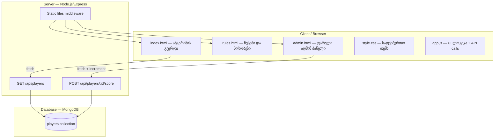

# 📋 PROJECT_PLAN: Football Bingo Score Tracker

> **პროექტი**: საფეხბურთო სტილის ქულების ტრეკერი 3 მოთამაშისთვის
> **შექმნის თარიღი**: 2026-04-16
> **ბოლო განახლება**: 2026-04-16
> **სტატუსი**: 🟡 Planning
> **Plugin Version**: 1.0.0

---

## 📖 პროექტის მიმოხილვა

### აღწერა
მობილურზე მორგებული, საფეხბურთო სტილის ვებ-საიტი, სადაც სამი მოთამაშე ერთმანეთს ეჯიბრება ქულებში. საიტს აქვს საჯარო მხარე სადაც ნებისმიერს შეუძლია დაინახოს მიმდინარე ანგარიში და ფარული ადმინ პანელი, სადაც მესაკუთრე მარტივად ზრდის მოთამაშეთა ქულებს.

### სამიზნე მომხმარებელი
- **მაყურებელი**: ნებისმიერი, ვინც შემოვა საიტზე და დაინახავს ანგარიშს, წესებს და ავატარებს
- **ადმინისტრატორი**: საიტის მფლობელი, რომელსაც აქვს წვდომა ფარულ `/admin` URL-ზე და მართავს ქულებს

### პროექტის ტიპი
Full-Stack Web App (Simple)

### საწყისი ქულები
- 🏆 მოთამაშე 1: **3 ქულა**
- ⚽ მოთამაშე 2: **5 ქულა**
- 🎯 მოთამაშე 3: **7 ქულა**

---

## 🏗️ არქიტექტურა



### მონაცემთა ნაკადი
1. მომხმარებელი ხსნის საიტს → `index.html` → `GET /api/players` → ჩანს ანგარიში
2. ადმინი ხსნის `/admin` → ხედავს 3 მოთამაშეს ღილაკებით `+1`, `+3`, `-1`
3. ღილაკზე დაჭერა → `POST /api/players/:id/score` → MongoDB განახლდება → UI განახლდება

---

## 💻 ტექნოლოგიური სტეკი

### Frontend
- **HTML5** — სემანტიკური მარკაპი
- **CSS3** — საფეხბურთო სტილი (მწვანე ველი, საფეხბურთო ბურთი, ვარსკვლავები)
- **Vanilla JavaScript (ES6+)** — fetch API, DOM manipulation
- **Responsive Design** — mobile-first, CSS Grid + Flexbox
- **Google Fonts** — Bebas Neue / Oswald (სპორტული ტიპოგრაფია)

### Backend
- **Node.js 20+**
- **Express.js** — REST API
- **Mongoose** — MongoDB ODM
- **dotenv** — environment variables
- **cors** — CORS middleware

### Database
- **MongoDB** (MongoDB Atlas — უფასო tier)
- კოლექცია: `players` { _id, name, avatar, score, position }

### Hosting
- **Frontend + Backend**: Railway ან Render (უფასო tier)
- **Database**: MongoDB Atlas (M0 — უფასო)

### Development
- Git / GitHub
- VS Code
- Postman — API ტესტირებისთვის

---

## 📁 პროექტის სტრუქტურა

```
bingo/
├── server/
│   ├── models/
│   │   └── Player.js
│   ├── routes/
│   │   └── players.js
│   ├── config/
│   │   └── db.js
│   ├── server.js
│   ├── .env
│   └── package.json
├── public/
│   ├── index.html          # საჯარო ანგარიშის გვერდი
│   ├── rules.html          # წესები და პირობები
│   ├── admin-x7k2.html     # ფარული ადმინ პანელი (დამალული URL)
│   ├── css/
│   │   └── style.css       # საფეხბურთო თემა
│   ├── js/
│   │   ├── app.js          # საჯარო გვერდის ლოგიკა
│   │   └── admin.js        # ადმინის ლოგიკა
│   └── assets/
│       ├── player1.png     # ავატარები
│       ├── player2.png
│       ├── player3.png
│       ├── ball.svg
│       └── field-bg.jpg
├── PROJECT_PLAN.md
├── README.md
└── .gitignore
```

---

## 🎨 დიზაინის სტილი (საფეხბურთო)

### ფერადოვანი პალიტრა
- 🟢 **მწვანე ველი**: `#0B6E4F` / `#2E8B57` (გრადიენტი)
- ⚪ **თეთრი ხაზები**: `#FFFFFF`
- 🟡 **ოქროსფერი აქცენტი**: `#FFD700` (ვარსკვლავებისთვის, ლიდერისთვის)
- ⚫ **მუქი ფონი**: `#0F1923` (ღამის სტადიონი)
- 🔴 **წითელი**: `#E63946` (შეცდომა / -1 ღილაკი)

### UI ელემენტები
- **საფეხბურთო ველის** ფონი header-ში (SVG ან CSS გრადიენტი მოწვენილი ხაზებით)
- **ვარსკვლავები** ლიდერის ქარდზე
- **ბურთი** decorative ელემენტად
- **კარტოჩკები** (ყვითელი/წითელი) — -1 ღილაკისთვის მინიშნებად
- მოთამაშის ქარდი = სტადიონის ტაბლო ესთეტიკა

### Responsive Breakpoints
- Mobile: `< 640px` — ერთი სვეტი, დიდი ტაპ-ზონები (min 44px)
- Tablet: `640px–1024px` — 2 სვეტი
- Desktop: `> 1024px` — 3 სვეტი გვერდიგვერდ

---

## ✅ ამოცანები ეტაპების მიხედვით

### 🎯 Phase 1: Foundation (საფუძველი)

#### T1.1: პროექტის ინიციალიზაცია
- [ ] **Status**: TODO
- **Complexity**: Low
- **Estimated**: 1 hour
- **Dependencies**: None
- **Description**:
  - ფოლდერების სტრუქტურის შექმნა
  - `git init`, `.gitignore`
  - `README.md` საწყისი
  - `npm init -y` server ფოლდერში

#### T1.2: Backend setup (Express + MongoDB)
- [ ] **Status**: TODO
- **Complexity**: Medium
- **Estimated**: 2 hours
- **Dependencies**: T1.1
- **Description**:
  - `express`, `mongoose`, `cors`, `dotenv` დაყენება
  - `server.js` — express app + static middleware `public/`
  - `config/db.js` — MongoDB კავშირი
  - `.env` — `MONGO_URI`, `PORT`, `ADMIN_PATH`

#### T1.3: MongoDB schema + seed data
- [ ] **Status**: TODO
- **Complexity**: Low
- **Estimated**: 1 hour
- **Dependencies**: T1.2
- **Description**:
  - `Player` model: `{ name, avatar, score, position }`
  - Seed script — 3 მოთამაშე საწყისი ქულებით (3, 5, 7)
  - MongoDB Atlas cluster-ის შექმნა

#### T1.4: REST API endpoints
- [ ] **Status**: TODO
- **Complexity**: Medium
- **Estimated**: 2 hours
- **Dependencies**: T1.3
- **Description**:
  - `GET /api/players` — ყველა მოთამაშის ჩამოთვლა (sorted by score desc)
  - `POST /api/players/:id/score` — body: `{ delta: 1 | 3 | -1 }`
  - Error handling + validation
  - Postman-ით ტესტირება

---

### 🎯 Phase 2: Core Features (ძირითადი ფუნქციონალი)

#### T2.1: საფეხბურთო CSS თემა
- [ ] **Status**: TODO
- **Complexity**: Medium
- **Estimated**: 3 hours
- **Dependencies**: T1.1
- **Description**:
  - CSS reset + ცვლადები (ფერები, ფონტები)
  - საფეხბურთო ველის background
  - Google Fonts ინტეგრაცია
  - Responsive grid setup

#### T2.2: საჯარო გვერდი (index.html) — ანგარიში
- [ ] **Status**: TODO
- **Complexity**: Medium
- **Estimated**: 3 hours
- **Dependencies**: T1.4, T2.1
- **Description**:
  - Header: საიტის ლოგო + ნავიგაცია (ანგარიში / წესები)
  - 3 მოთამაშის ქარდი ავატარით, სახელით, ქულით
  - ლიდერის გამოყოფა ოქროს ვარსკვლავით
  - `fetch('/api/players')` → DOM rendering
  - ავტომატური რეფრეში ყოველ 10 წამში

#### T2.3: ავატარების დიზაინი
- [ ] **Status**: TODO
- **Complexity**: Low
- **Estimated**: 1 hour
- **Dependencies**: T2.1
- **Description**:
  - 3 ავატარი (placeholder → საფეხბურთო სტილი)
  - წრიული ფრეიმი ოქროსფერი ჩარჩოთი
  - მინიმუმ 2x რეზოლუცია retina ეკრანებისთვის

#### T2.4: წესები და პირობები (rules.html)
- [ ] **Status**: TODO
- **Complexity**: Low
- **Estimated**: 2 hours
- **Dependencies**: T2.1
- **Description**:
  - თამაშის წესების აღწერა (როგორ ემატება ქულა, რა პირობებია)
  - ფორმატირებული ტექსტი, სექციები
  - უკან დაბრუნების ღილაკი
  - Mobile-friendly typography

---

### 🎯 Phase 3: Admin Panel (ადმინ პანელი)

#### T3.1: ფარული ადმინ URL
- [ ] **Status**: TODO
- **Complexity**: Low
- **Estimated**: 30 min
- **Dependencies**: T1.2
- **Description**:
  - ფაილის სახელი: `admin-x7k2.html` (რანდომ suffix)
  - `robots.txt` — `Disallow: /admin-x7k2.html`
  - არ მოხვდეს ძირითად ნავიგაციაში
  - `.env` ცვლადში ინახება URL path

#### T3.2: ადმინ UI — ქულების მართვა
- [ ] **Status**: TODO
- **Complexity**: Medium
- **Estimated**: 3 hours
- **Dependencies**: T2.2, T3.1
- **Description**:
  - 3 მოთამაშის ქარდი ღილაკებით:
    - `+1` (მწვანე)
    - `+3` (ოქროსფერი — გოლი!)
    - `-1` (წითელი)
    - `Reset` (ნულზე დაბრუნება — confirm dialog)
  - მიმდინარე ქულის ჩვენება რეალურ დროში
  - Toast notifications ცვლილებებზე

#### T3.3: Admin API integration
- [ ] **Status**: TODO
- **Complexity**: Medium
- **Estimated**: 2 hours
- **Dependencies**: T1.4, T3.2
- **Description**:
  - `admin.js` — fetch POST-ები ღილაკებზე
  - Optimistic UI update
  - Error handling + rollback თუ API ჩავარდა
  - Loading states

---

### 🎯 Phase 4: Polish & Deployment

#### T4.1: Mobile optimization
- [ ] **Status**: TODO
- **Complexity**: Medium
- **Estimated**: 2 hours
- **Dependencies**: T2.2, T3.2
- **Description**:
  - ტაპ-ზონების ზომა ≥44px
  - Viewport meta tag
  - ტესტი iPhone SE (375px) და Galaxy (360px) ზომაზე
  - Landscape orientation
  - Touch feedback (active states)

#### T4.2: ანიმაციები
- [ ] **Status**: TODO
- **Complexity**: Low
- **Estimated**: 1.5 hours
- **Dependencies**: T2.2, T3.2
- **Description**:
  - ქულის ცვლილებისას number counter ანიმაცია
  - ქარდების hover/press ეფექტები
  - ლიდერის ცვლილებისას ვარსკვლავი ანიმაცია
  - CSS transitions, არ ანელებდეს mobile-ს

#### T4.3: Favicon + meta tags
- [ ] **Status**: TODO
- **Complexity**: Low
- **Estimated**: 30 min
- **Dependencies**: T1.1
- **Description**:
  - საფეხბურთო ბურთი favicon-ად
  - OG tags (title, description, image)
  - Mobile theme-color

#### T4.4: Deployment
- [ ] **Status**: TODO
- **Complexity**: Medium
- **Estimated**: 2 hours
- **Dependencies**: ყველა წინა ამოცანა
- **Description**:
  - MongoDB Atlas production cluster
  - Railway/Render deployment
  - Environment variables კონფიგურაცია
  - Custom domain (არასავალდებულო)
  - HTTPS-ის შემოწმება

#### T4.5: ტესტირება და ბაგების შესწორება
- [ ] **Status**: TODO
- **Complexity**: Medium
- **Estimated**: 2 hours
- **Dependencies**: T4.4
- **Description**:
  - Cross-browser ტესტი (Chrome, Safari, Firefox)
  - Mobile ფიზიკურ მოწყობილობაზე ტესტი
  - ადმინ flow end-to-end
  - Load ტესტი (რეფრეში ბევრჯერ)
  - Lighthouse audit (≥90 performance)

---

## 📊 პროგრესი

- **სულ ამოცანა**: 16
- **შესრულებული**: 0
- **მიმდინარე**: 0
- **დაბლოკილი**: 0
- **პროცენტი**: 0%
- **პროგრეს ბარი**: ⬜⬜⬜⬜⬜⬜⬜⬜⬜⬜

### 🎯 მიმდინარე ფოკუსი
- **შემდეგი ამოცანა**: T1.1 — პროექტის ინიციალიზაცია
- **ეტაპი**: 1 — Foundation

---

## 🎯 წარმატების კრიტერიუმები

### MVP (მინიმალური სიცოცხლისუნარიანი პროდუქტი)
- ✅ 3 მოთამაშე ჩანს საჯარო გვერდზე საწყისი ქულებით (3, 5, 7)
- ✅ ადმინ პანელიდან ქულის გაზრდა / შემცირება მუშაობს
- ✅ ცვლილებები დროში ნარჩუნდება (MongoDB)
- ✅ საიტი კარგად ჩანს მობილურზე (375px ეკრანზე)
- ✅ წესების გვერდი ხელმისაწვდომია
- ✅ საფეხბურთო სტილი ნათლად ჩანს
- ✅ ადმინ URL ფარულია (რობოტები ვერ ინდექსირებენ)

### Nice-to-Have (შემდეგი ეტაპზე)
- 🔮 ქულის ცვლილების ისტორია (log)
- 🔮 Password protection ადმინისთვის
- 🔮 მატჩის ტაიმერი
- 🔮 მოთამაშეების სახელების რედაქტირება
- 🔮 Dark/Light mode
- 🔮 PWA — ინსტალაცია მობილურზე

---

## 📝 შენიშვნები

### უსაფრთხოების გაფრთხილება
ფარული URL **არ არის** რეალური უსაფრთხოება. ვინც URL-ს იცის, ვერ შევა. MVP-სთვის საკმარისია, მაგრამ მომავალში აუცილებელია:
- მინიმუმ Basic Auth
- იდეალურად JWT + login

### MongoDB Atlas Setup
1. შექმენი უფასო M0 cluster
2. Network Access → Allow from anywhere (0.0.0.0/0) — dev-ისთვის
3. Database Access → User + password
4. Connection string → `.env` ფაილში

---

**წარმატებები! ⚽🏆**
